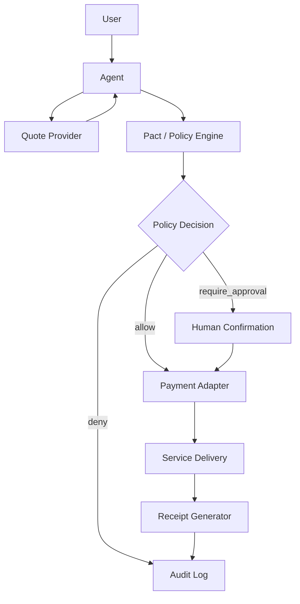

# Week 2 总交付：方向深挖包与项目初步 Proposal

周期：2026-05-29 至 2026-06-05  
总入口：本文件  
公开仓库：https://github.com/web3yaso/ai-web3-school-cohort-0

## 一句话总结

Week 2 我把主方向收敛到 **Payment / Commerce / Settlement**，并把它具体化为一个面向 agent 购买服务、API、数据和电商订单的项目雏形：

> Agent Commerce Receipt Layer：让 agent 在受预算、商户、合约、时间窗口和人工确认规则约束下完成小额机器支付，并为每次报价、付款、交付和验收生成可审计 receipt。

核心判断是：AI 负责理解任务、选择服务、生成订单、检查交付；Web3 负责开放支付、可验证结算、钱包权限、撤销和审计。两者缺一不可。

## 1. 方向深挖结论

本周对 AI x Web3 的六个方向做了速览和判断矩阵：

| 方向 | 本周判断 | 后续定位 |
| --- | --- | --- |
| Payment / Commerce / Settlement | 主方向 | Hackathon proposal 主线 |
| Wallet / Permission / Safe Execution | 强相关支撑方向 | 作为 agent payment 的安全边界 |
| Identity / Reputation / Capability / Interoperability | 后续扩展 | 用于 agent / merchant profile 和 reputation |
| Privacy / Security / Sovereignty | 风险补充 | 用于 prompt injection、secret boundary、日志隐私 |
| Dev Tooling / Agent Workflow | 实现方式 | 用 mock、schema、policy engine 做 reference implementation |
| Governance / Coordination / Public Goods | 旁支案例 | DAO alert-to-action workflow 可独立沉淀 |

本周最终选择 `Payment / Commerce / Settlement`，不是因为它最容易，而是因为它最能同时体现 AI 和 Web3 的必要性：

- AI 不只是聊天，而是理解需求、规划购买路径、选择服务、检查交付质量。
- Web3 不只是转账，而是提供开放机器支付、付款证明、可验证收据、可撤销权限和结算记录。
- 真实场景足够窄：API / 数据 / 小额服务 / 电商购物都可以用同一套报价、付款、交付、验收模型表达。
- 一周内可验证：可以先用 mock 状态机、receipt schema、policy engine 和测试网交易记录证明路径成立。

对应笔记：

- [AI x Web3 Direction Selection](../tasks/2026-05-30-ai-web3-direction-selection.md)
- [Virtuals Protocol Agent-to-Agent Economy Research](../tasks/2026-05-29-virtuals-protocol-agent-economy.md)
- [AgentCash Marketplace Transaction Flow](../tasks/2026-05-31-agentcash-marketplace-transaction-flow.md)
- [ERC-8183 vs x402](../tasks/ERC-8183_vs_x402.md)

## 2. 问题定义

如果未来 agent 能代表用户购买 API、数据、算力、工具调用、电商订单或其他 agent 服务，它需要的不只是“能付款”的钱包，而是一套完整的交易边界：

```text
用户意图
  -> 服务发现
  -> 报价
  -> 预算检查
  -> 权限确认
  -> 付款
  -> 交付
  -> 验收
  -> 收据 / 审计
  -> 异常处理 / 争议处理
```

当前直接给 agent 一个热钱包会带来几个问题：

- agent 可能被 prompt injection 诱导，把钱付给错误地址。
- 一次授权可能变成长期权限，尤其是 token approval 或 session key 过宽。
- 付款和交付之间缺少统一 receipt，事后难以证明订单、金额、商户、交易哈希和交付结果是否匹配。
- 服务方、用户和 agent 之间很难在没有中心化账号体系的情况下完成低摩擦小额交易。
- 付款失败、重复提交、价格变化、商户地址变化和外部依赖异常都需要明确状态机。

因此本项目要解决的问题是：

> 如何让 agent 可以安全地购买服务，同时把每一次机器支付变成有边界、可撤销、可审计、可验证的交易记录？

## 3. 目标用户和真实场景

### 目标用户

| 用户 | 需求 |
| --- | --- |
| Agent workflow 开发者 | 希望 agent 可以购买 API、数据、工具调用或服务，但不想直接暴露钱包私钥 |
| API / 数据服务商 | 希望按次向 agent 收费，不依赖传统订阅、人工开票或账号审批 |
| 电商 / 服务平台 | 希望支持 agent 下单，但需要预算、风控、收据和争议处理 |
| Web3 builder | 希望有一个可复用的 machine payment reference implementation |

### 真实场景 A：Research Agent 购买付费数据

用户要求 agent 找某个赛道的项目、创始人、融资信息和联系方式。agent 在预算内调用付费数据 API，通过 x402 / MPP 风格支付完成请求，并在最后生成调用成本、付款证明和数据来源摘要。

对应笔记：

- [AgentCash Marketplace Transaction Flow](../tasks/2026-05-31-agentcash-marketplace-transaction-flow.md)

### 真实场景 B：Shopping Agent 小额付款

用户授权一次购物 Pact：商户、金额、token、链、时间窗口和付款次数都受限制。agent 可以自动支付白名单商户的小额订单，但新商户、大额付款、approval、订阅或地址变化必须人工确认。

对应笔记：

- [电商购物 Agent Wallet 权限策略](../tasks/2026-06-01-ecommerce-agent-wallet-policy.md)
- [购物 Agent Threat Model](../tasks/2026-06-02-shopping-agent-threat-model.md)
- [购物 Agent 自动执行 / 人工确认策略](../tasks/2026-06-02-shopping-agent-execution-policy.md)

## 4. 项目初步 Proposal

### 项目名

Agent Commerce Receipt Layer

### 项目定位

一个面向 agent 支付场景的轻量 receipt + policy + workflow reference implementation。

它不试图一开始做完整 marketplace，也不托管用户资产。它先解决一件事：

> 对一次 agent 购买行为，生成结构化报价、付款边界、policy 判断、交易证明、交付状态和验收 receipt。

### 项目目标

- 让 agent 能在预算和权限边界内购买一次 API、数据或小额服务。
- 把服务报价、付款证明、交付结果和验收状态绑定成一个 receipt。
- 让每次付款前都有 policy 判断：`allow` / `require_approval` / `deny`。
- 让高风险动作进入人工确认，而不是让 agent 自行决定。
- 让 demo 可以先用 mock payment proof 跑通，后续再接 x402、Base Sepolia 或智能账户。

### 非目标

- 不做完整电商平台。
- 不托管用户资金。
- 不让 agent 持有 owner key。
- 不实现任意链上交易执行。
- 不支持 DEX、bridge、lending、staking、NFT mint 或 unlimited approval。
- 不把完整订单隐私信息写上链。

## 5. MVP 功能范围

### 必须有

| 模块 | MVP 功能 |
| --- | --- |
| Quote | 服务方返回结构化报价：服务、价格、token、chain、merchant、过期时间 |
| Pact | 用户或 policy 授权一次任务级付款边界 |
| Policy Engine | 检查金额、商户、token、chain、合约、动作、时间窗口 |
| Payment Proof | 记录 tx hash、mock proof 或 x402 / MPP payment proof |
| Delivery | 记录服务是否交付、交付摘要和数据 hash |
| Receipt | 汇总 quote、pact、payment、delivery、acceptance、audit trail |
| Audit Log | 记录每次 allow、deny、require_approval 的原因 |

### 可以延后

- 真正链上 escrow。
- 多 agent reputation。
- ERC-8004 identity registry 集成。
- Safe / ERC-4337 session key 实装。
- 自动争议仲裁。
- 多商户 marketplace UI。

## 6. 核心数据结构草案

### Quote

```json
{
  "quote_id": "quote_001",
  "merchant_id": "merchant_research_api",
  "service": "company_funding_enrichment",
  "price": {
    "amount": "2.50",
    "currency": "USDC",
    "chain_id": 84532
  },
  "payment": {
    "method": "x402_or_mock",
    "recipient": "0xMerchantAddress",
    "expires_at": "2026-06-05T12:00:00Z"
  },
  "delivery": {
    "format": "json",
    "schema": "lead_list_v1"
  }
}
```

### Pact

```json
{
  "pact_id": "pact_001",
  "agent_id": "agent_research_01",
  "allowed_merchant_ids": ["merchant_research_api"],
  "allowed_tokens": ["USDC"],
  "max_single_payment_usd": "10",
  "max_total_budget_usd": "30",
  "valid_until": "2026-06-05T13:00:00Z",
  "max_successful_payments": 3,
  "requires_human_review": [
    "new_merchant",
    "price_increase_above_10_percent",
    "token_approval",
    "recipient_address_changed"
  ]
}
```

### Receipt

```json
{
  "receipt_id": "receipt_001",
  "quote_id": "quote_001",
  "pact_id": "pact_001",
  "policy_result": "allow",
  "payment": {
    "status": "paid",
    "proof_type": "mock_or_tx_hash",
    "tx_hash": "0x..."
  },
  "delivery": {
    "status": "delivered",
    "result_hash": "sha256:...",
    "accepted_at": "2026-06-05T12:05:00Z"
  },
  "audit": [
    {
      "event": "policy_checked",
      "decision": "allow",
      "reason": "merchant allowlisted, amount under pact budget"
    }
  ]
}
```

## 7. 技术架构草案



### 组件说明

| 组件 | 职责 |
| --- | --- |
| Agent | 理解用户需求，选择服务，提交 quote 和付款请求 |
| Quote Provider | 模拟或接入 x402 / API 服务方报价 |
| Policy Engine | 判断本次付款是否在 Pact 范围内 |
| Payment Adapter | MVP 阶段支持 mock proof，后续支持 tx hash / x402 proof |
| Receipt Generator | 生成结构化 receipt |
| Audit Log | 保存状态机、policy 决策和失败原因 |

## 8. 状态机

```text
USER_INTENT
  -> QUOTE_REQUESTED
  -> QUOTE_RECEIVED
  -> PACT_CHECKED
  -> POLICY_ALLOWED | HUMAN_REVIEW_REQUIRED | POLICY_DENIED
  -> PAYMENT_PREPARED
  -> PAYMENT_PROVED
  -> SERVICE_DELIVERED
  -> DELIVERY_ACCEPTED | DELIVERY_REJECTED
  -> RECEIPT_READY
```

失败分支：

```text
QUOTE_EXPIRED
PAYMENT_FAILED
PAYMENT_RETRY_LIMIT_REACHED
MERCHANT_ADDRESS_MISMATCH
PRICE_CHANGED_REVIEW_REQUIRED
DELIVERY_TIMEOUT
POLICY_DENIED
PACT_REVOKED
```

## 9. 安全边界

本项目的安全边界来自本周三份购物 agent wallet 笔记：

- [ERC-4337、Safe、Guard / Policy 机制为什么重要](../tasks/2026-06-01-agent-wallet-account-control-mechanisms.md)
- [电商购物 Agent Wallet 权限策略](../tasks/2026-06-01-ecommerce-agent-wallet-policy.md)
- [购物 Agent Threat Model](../tasks/2026-06-02-shopping-agent-threat-model.md)

默认策略：

- agent 不持有 owner key。
- 每个任务使用短期 Pact，不给长期无限权限。
- 只允许稳定币付款，例如 USDC。
- 只允许白名单商户和付款类函数。
- 单笔小额可以自动执行，大额或新商户必须人工确认。
- token approval、Permit2、预算提升、商户地址变化必须人工确认。
- DEX、bridge、lending、staking、NFT mint、unlimited approval 默认拒绝。
- 所有 policy 判断写入 audit log。
- 用户可以 revoke Pact 或 emergency freeze。

## 10. 验证计划

### 本地验证

- 用 mock quote 跑通一次购买流程。
- 用 policy engine 验证三类结果：`allow`、`require_approval`、`deny`。
- 用 receipt schema 检查字段完整性。
- 用 regression cases 测试常见风险：
  - 白名单商户小额付款。
  - 新商户首次付款。
  - 金额超过自动执行阈值。
  - 收款地址与 merchant ID 不匹配。
  - 需要 token approval。
  - quote 过期。
  - 重复付款请求。

### 链上或支付验证

可选验证路径：

- 使用 Base Sepolia 的测试网交易 hash 作为 payment proof。
- 复用 [x402 Receipt Registry Practice](../tasks/2026-05-25-x402-testnet-contract.md) 中的最小收据合约草案。
- 后续接入 x402 / MPP 风格 payment proof。

已有相关链上基础：

- [Base Sepolia Testnet Transaction Record](../tasks/2026-05-24-testnet-transaction.md)
- [X402ReceiptRegistry.sol](../contracts/X402ReceiptRegistry.sol)

### 可运行脚本延续

Week 1 已有本地 mock 和 prompt regression 基础，可以作为 Week 2 MVP 的测试风格参考：

```bash
sh scripts/run_min_practices.sh
python3 experiments/transaction_risk_summary_prompt.py
python3 experiments/crops_agent_evaluator.py
```

## 11. Demo 计划

### Demo v0：纯本地 mock

输入：

```text
帮我购买一次 company funding enrichment API，预算 10 USDC，只允许 merchant_research_api。
```

输出：

- quote JSON
- pact JSON
- policy decision
- mock payment proof
- delivery summary
- receipt JSON
- audit log

成功标准：

- 白名单商户、金额在预算内时自动 `allow`。
- 新商户或金额超限时 `require_approval`。
- 非白名单地址、unlimited approval、非付款类合约调用时 `deny`。
- 最终 receipt 能证明 quote、payment、delivery 和 acceptance 的对应关系。

### Demo v1：接入测试网 proof

在不托管资产的前提下，把 mock payment proof 替换成：

- Base Sepolia tx hash；或
- x402 / MPP 风格 payment proof；或
- `X402ReceiptRegistry` 的 receipt hash 写入记录。

## 12. Week 2 Proof 清单

| Proof | 说明 |
| --- | --- |
| [方向选择](../tasks/2026-05-30-ai-web3-direction-selection.md) | 方向速览、判断矩阵和早期 proposal 雏形 |
| [Virtuals Agent Economy](../tasks/2026-05-29-virtuals-protocol-agent-economy.md) | Agent identity、x402、ACP、agent-to-agent economy 研究 |
| [AgentCash Transaction Flow](../tasks/2026-05-31-agentcash-marketplace-transaction-flow.md) | 付费 API / marketplace / x402 调用流程拆解 |
| [Codex Agent 自我分析](../tasks/2026-05-31-codex-agent-self-analysis.md) | 对 agent 身份、能力、边界和失败点的拆解 |
| [Agent Wallet 机制](../tasks/2026-06-01-agent-wallet-account-control-mechanisms.md) | ERC-4337、Safe、Guard / Policy 在 agent wallet 中的作用 |
| [电商 Agent Wallet Policy](../tasks/2026-06-01-ecommerce-agent-wallet-policy.md) | 购物 Pact、预算、合约 allowlist、撤销、日志 |
| [Shopping Agent Threat Model](../tasks/2026-06-02-shopping-agent-threat-model.md) | 资产、权限、数据、工具、依赖和失败后果模型 |
| [Shopping Agent Execution Policy](../tasks/2026-06-02-shopping-agent-execution-policy.md) | 低风险自动执行、高风险人工确认、直接拒绝规则 |
| [Aave DAO Alert-to-Action Workflow](../tasks/2026-06-02-aave-dao-ai-alert-to-action-workflow.md) | DAO 风险治理中的 AI 辅助边界案例 |

## 13. 下一步

Week 3 建议把 proposal 推进成最小 prototype：

1. 新增 `experiments/agent_commerce_receipt_layer.py`。
2. 定义 `Quote`、`Pact`、`PolicyDecision`、`PaymentProof`、`Receipt` 数据结构。
3. 写 6-8 个 regression cases。
4. 输出一份可读的 demo transcript。
5. 选择是否接入 Base Sepolia tx hash 或 x402 风格 mock proof。
6. 把 README、demo 脚本和风险边界整理成 Hackathon 项目材料。

## 14. 可提交摘要

本周完成了 AI x Web3 方向深挖，并将主方向收敛为 Payment / Commerce / Settlement。产出包括方向判断矩阵、Virtuals agent-to-agent economy 研究、AgentCash / x402 交易流程拆解、agent wallet 权限机制、购物 agent threat model、自动执行 / 人工确认策略，以及一个初步项目 proposal：Agent Commerce Receipt Layer。

该项目希望解决 agent 购买 API、数据、服务或电商订单时的安全支付与可审计收据问题。MVP 将先用 mock quote、policy engine、payment proof 和 receipt schema 跑通一次完整购买流程，并把高风险付款、授权扩展、新商户、地址变化和外部异常全部放入人工确认或拒绝路径。
