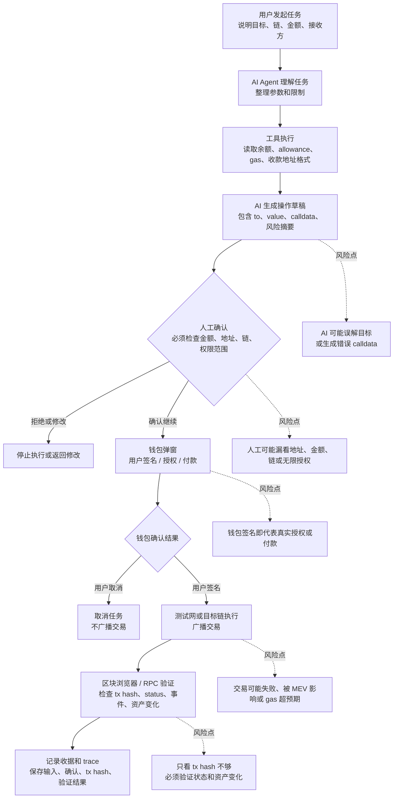

# Task: AI x Web3 Workflow Boundary

## 任务目标

画出一个最小 AI x Web3 工作流，理解 AI 系统和链上操作之间的边界。

这个版本选择的场景是：用户让 Agent 准备一笔小额链上支付或 ERC-20 授权，但最终链上执行必须由用户通过钱包确认。

## 最小工作流

## 边界说明

| 步骤 | 谁发起 | 谁执行 | 是否需要钱包签名 / 付款 / 授权 | 是否必须人工确认 | 如何验证结果 | 主要风险点 |
| --- | --- | --- | --- | --- | --- | --- |
| 用户描述任务 | 用户 | 用户 | 否 | 是，确认目标真实意图 | 任务参数可被复述 | 目标不清、链或地址说错 |
| AI 理解任务 | 用户触发 | AI Agent | 否 | 否 | 输出结构化参数 | AI 误解金额、token、接收方或链 |
| 工具读取链上信息 | AI Agent | RPC / 区块浏览器 / 合约读工具 | 否 | 否 | 返回 block number、余额、allowance | RPC 数据过期、读错网络、地址格式错误 |
| 生成交易草稿 | AI Agent | AI Agent / 编码工具 | 否 | 进入人工确认前不能执行 | 展示 to、value、calldata、token delta、gas 估算 | calldata 错误、无限授权、spender 不可信 |
| 人工复核 | AI Agent 提示 | 用户 | 否 | 是，必须人工确认 | 用户明确同意或拒绝 | 用户只看 AI 摘要，不看钱包明细 |
| 钱包确认 | 用户点击继续后 | 钱包 + 用户 | 是，签名 / 授权 / 付款发生在这里 | 是，用户在钱包内再次确认 | 钱包显示的链、地址、金额、权限与草稿一致 | 签错链、签无限授权、恶意 dApp 替换交易 |
| 链上执行 | 钱包广播 | 区块链网络 | 已完成签名后才可能执行 | 否 | 获得 tx hash 和 receipt | 交易失败、pending、gas 超预期、被抢跑 |
| 结果验证 | 交易提交后 | 区块浏览器 / RPC / Agent | 否 | 高价值操作建议人工复核 | 检查 status、event log、余额变化、授权变化 | 只验证 hash，不验证最终状态 |
| 记录 trace | 验证完成后 | Agent / 本地记录系统 | 否 | 否 | 保存任务输入、工具输出、确认记录、tx hash、receipt | 日志泄露隐私或漏记关键决策 |

## 关键结论

- AI 可以理解目标、调用只读工具、生成说明和交易草稿，但不应该绕过用户直接签名。
- 链上状态改变的边界在钱包签名处：签名、授权、付款必须由用户确认。
- 人工确认至少出现两次：一次在 AI 摘要阶段，一次在钱包弹窗阶段。
- 验证不能只看“交易已提交”，还要看 receipt status、事件日志、资产变化和授权变化。
- 风险最大的地方不是 AI 写文字，而是 AI 生成的草稿被用户签名后会变成真实链上动作。

## 完成情况

- 已完成一个最小 AI x Web3 工作流图。
- 已标出任务发起者、执行者、钱包签名 / 付款 / 授权步骤、人工确认步骤、验证方式和风险点。
- 未执行真实链上交易。

## 验证方式

- 检查 Mermaid 图是否覆盖从任务发起到收据验证的完整闭环。
- 检查边界表是否包含每个要求字段：谁发起、谁执行、签名 / 付款 / 授权、人工确认、验证方式、风险点。

## 产出链接

- `tasks/2026-05-26-ai-web3-workflow-boundary.md`

## 参考资源

- https://aiweb3.school/zh/handbook/bridge/agent-workflow/
- https://aiweb3.school/zh/handbook/bridge/web3-tool-use/
