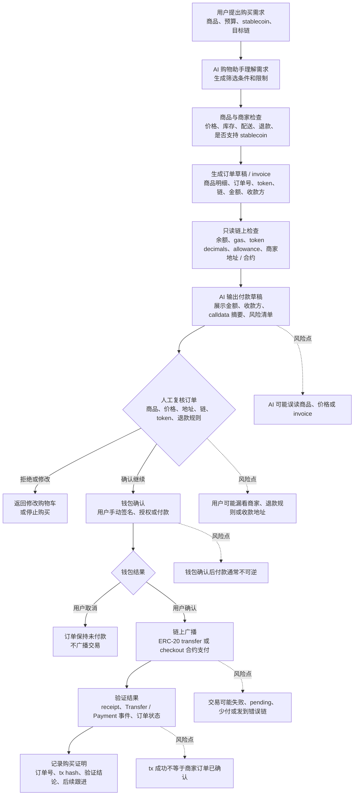

# Task: Stablecoin AI Shopping Assistant Workflow Boundary

## 任务目标

设计一个受限 Web3 助手或小 workflow：用户想用 stablecoin 购买商品，AI 购物助手可以辅助选品、生成订单草稿、准备付款说明和验证结果，但不能接触私钥、助记词、API Key，也不能绕过人工确认完成签名、授权、转账或合约写入。

这个版本选择的场景是：用户让 AI 购物助手购买一件商品，例如用 Base 上的 USDC 支付一件硬件设备、课程门票或数字商品。AI 可以把“想买什么”变成可检查的购物车和链上付款草稿，最终下单和付款必须由用户在商家页面和钱包中确认。

## 受限助手设计

### Workflow 名称

受限 Stablecoin 购物助手。

### 用户输入是什么

用户需要明确提供：

- 商品需求：商品名称、规格、数量、预算、是否接受替代品。
- 商家范围：指定商家、允许搜索的商家，或只允许已知可信商家。
- 支付偏好：stablecoin 类型，例如 USDC / USDT / DAI；目标网络，例如 Base、Optimism、Ethereum、Polygon。
- 收货信息：配送国家 / 地区、邮编、联系方式；公开仓库中不能保存完整隐私信息。
- 钱包地址：用于余额检查和支付准备的公开地址。
- 风险限制：最高可接受价格、最高 gas、是否允许跨链、是否允许授权给商家合约。

用户不能输入、粘贴或交给 AI 的内容：

- 私钥、助记词、keystore 文件。
- 钱包 API Key、RPC Key、交易所 Key。
- 钱包解锁密码、短信验证码、MFA code、硬件钱包确认码。
- 完整身份证件、银行卡信息或不必要的隐私数据。

### AI / Agent 做什么

AI 可以辅助：

- 理解用户需求，生成商品筛选条件和候选清单。
- 检查商品页、价格、库存、配送范围、退货规则和是否支持 stablecoin 支付。
- 把候选商品整理成对比表，说明价格、链、token、商家收款方式、预计 gas 和主要风险。
- 生成购物车草稿和订单摘要，包括商品、数量、总价、运费、税费、支付 token、目标链和商家收款地址 / 合约。
- 调用只读 Web3 工具检查用户公开地址的 stablecoin 余额、token decimals、当前 gas、商家收款地址格式和合约验证状态。
- 准备付款说明：如果是直接 ERC-20 转账，展示 `to`、token、amount；如果是 checkout 合约，展示合约地址、方法名、calldata 摘要和预期事件。
- 在用户付款后，根据 tx hash 验证 receipt、`Transfer` / `PaymentReceived` 事件、订单状态和商家确认页面。
- 生成购买记录草稿，记录商品、订单号、tx hash、验证结果和后续人工跟进事项。

AI 不能自动执行：

- 读取、保存、转发、推断或要求用户提供私钥 / 助记词 / API Key。
- 自动点击“确认下单”“连接钱包”“签名”“授权”“付款”或“写入合约”。
- 自动签署 ERC-20 `approve`、Permit、SIWE、订单授权、转账或 checkout 合约调用。
- 绕过钱包弹窗、MFA、CAPTCHA、硬件钱包确认、商家风控或人工复核。
- 在用户没有明确确认时提交订单、广播交易，或把“AI 判断价格合理”当作用户购买授权。

### Web3 工具或链上步骤是什么

1. 商品准备：AI 读取商品信息，生成候选清单和购物车草稿。
2. 订单报价：商家 checkout 页面或支付 API 生成 invoice，包含订单号、商品明细、收款地址 / checkout 合约、token、链、金额和过期时间。
3. 只读链上检查：AI 查询用户 stablecoin 余额、目标链 gas、token decimals、商家地址格式、合约验证状态和当前 allowance。
4. 付款草稿：AI 生成付款说明，但不签名、不广播；草稿必须展示链、token、金额、收款方、订单号和 invoice 过期时间。
5. 人工复核订单：用户检查商品、价格、收货信息、商家、退款规则、链、token、金额和收款方。
6. 钱包确认付款：用户在钱包中手动确认 ERC-20 转账，或确认 `approve` + checkout 合约支付。
7. 链上广播：钱包或商家 checkout 组件广播交易，返回 tx hash。
8. 结果验证：AI 用区块浏览器 / RPC / 商家订单页检查 tx receipt、事件日志、订单状态和资产变化。
9. 购买记录：AI 生成收据记录和后续跟进清单，例如物流、下载链接、退款窗口。

### 哪些步骤必须人工确认

- 商品确认：用户确认要买的具体商品、规格、数量和商家。
- 价格确认：用户确认商品价格、运费、税费、汇率、gas 和最终支付金额。
- 隐私确认：用户确认是否在商家页面提交收货地址、邮箱或电话。
- 订单确认：用户在商家 checkout 页面确认订单号、invoice、付款期限和退款规则。
- 支付确认：用户必须在钱包界面亲自确认 ERC-20 转账、授权、Permit 或 checkout 合约写入。
- 高风险二次确认：主网大额支付、未知商家、无限授权、跨链支付、可升级 checkout 合约、不可退款商品必须二次确认。

### 如何验证执行结果

- 检查 tx hash 是否在正确网络上存在，且 receipt `status` 为成功。
- 对直接 stablecoin 转账，检查 `Transfer` 事件中的 `from`、`to`、`amount` 是否与 invoice 一致。
- 对 checkout 合约支付，检查合约事件是否包含正确订单号、payer、token、amount 和 merchant。
- 检查用户 stablecoin 余额减少金额是否符合预期，避免把 pending 或 failed 交易当作已付款。
- 检查商家订单页面、邮件或 API 状态是否从 `unpaid` / `pending` 变成 `paid` / `confirmed`。
- 保存订单号、invoice、tx hash、block number、验证时间、商家确认截图或链接。
- 如果订单未确认，先不要重复支付；应检查 invoice 是否过期、链是否错误、金额是否少付、商家是否需要人工入账。

### 风险和限制

- AI 可能买错商品、规格、数量或误读商家库存和配送范围。
- Stablecoin 支付通常不可逆，链上付款成功不等于商家一定发货。
- 商家收款地址或 checkout 合约可能被替换、钓鱼或未验证。
- Invoice 可能过期，金额可能因运费、税费、汇率或库存变化而改变。
- ERC-20 授权可能超过本次订单所需额度，尤其要避免无限授权给未知商家。
- 不同链上的 USDC / USDT 不是同一个资产，跨链支付可能导致资金丢失或延迟。
- 公开链会暴露付款地址、金额、时间和商家关系，存在隐私风险。
- AI 的输出只能作为购物和付款辅助，不能替代用户对商家可信度、商品真实性和钱包弹窗内容的最终判断。

## 最小工作流

## 边界说明

| 步骤 | 谁发起 | 谁执行 | 是否需要钱包签名 / 付款 / 授权 | 是否必须人工确认 | 如何验证结果 | 主要风险点 |
| --- | --- | --- | --- | --- | --- | --- |
| 用户描述购买需求 | 用户 | 用户 | 否 | 是，确认真实购买意图 | AI 复述商品、预算、链和 token | 需求不清、买错商品 |
| 商品与商家筛选 | 用户触发 | AI Agent / Web 工具 | 否 | 候选结果需用户确认 | 商品链接、价格、库存、配送规则可被复查 | 商品信息过期、商家不可信 |
| 生成订单草稿 | 用户触发 | AI Agent / 商家 checkout | 否 | 是，进入付款前必须确认 | 订单号、商品明细、总价、invoice | 税费、运费、汇率或库存变化 |
| 只读链上检查 | AI Agent | RPC / 区块浏览器 / 合约读工具 | 否 | 否 | 返回 block number、余额、allowance、gas | 读错网络、RPC 延迟、token 地址错误 |
| 付款草稿 | AI Agent | AI Agent / 编码工具 | 否 | 是，草稿不能直接执行 | 展示链、token、amount、to、calldata 摘要 | 收款地址错误、calldata 错误、invoice 过期 |
| 人工复核订单 | AI 提示 | 用户 | 否 | 是 | 用户明确继续、修改或取消 | 用户只看摘要，不看商家和钱包明细 |
| 钱包确认 | 用户点击继续后 | 钱包 + 用户 | 是，签名 / 授权 / 付款发生在这里 | 是，用户在钱包内再次确认 | 钱包显示内容与订单草稿一致 | 签错链、无限授权、钓鱼收款地址 |
| 链上执行 | 钱包广播 | 区块链网络 | 已完成签名后才可能执行 | 否 | 获得 tx hash 和 receipt | 失败、pending、gas 超预期、少付 |
| 商家确认 | 交易提交后 | 商家系统 / checkout 合约 / AI 验证 | 否 | 异常时需人工跟进 | 订单状态变为 paid / confirmed | 链上成功但商家未入账 |
| 记录 trace | 验证完成后 | AI / 本地记录系统 | 否 | 否 | 保存订单号、tx hash、验证结果 | 日志泄露隐私或漏记关键决策 |

## 关键结论

- AI 可以帮助用户选商品、比价、生成购物车、解释 invoice、准备付款草稿和验证收据。
- AI 不能替用户完成购买决策，也不能自动签名、授权、付款或写入合约。
- Stablecoin 购物的安全边界有两个：商家订单确认和钱包付款确认。
- 验证不能只看交易成功，还要确认商家订单状态已经变成 paid / confirmed。
- 最小可行设计应该默认小额、可信商家、单一 stablecoin、单一网络、无无限授权、人工确认后再付款。

## 完成情况

- 已完成一个 stablecoin 购物助手的最小 AI x Web3 工作流图。
- 已标出用户输入、AI 可辅助步骤、链上步骤、人工确认点、验证方式、风险和限制。
- 未执行真实下单或链上交易。

## 验证方式

- 检查 Mermaid 图是否覆盖从购买需求到商家确认和购买记录的完整闭环。
- 检查边界表是否包含每个要求字段：谁发起、谁执行、签名 / 付款 / 授权、人工确认、验证方式、风险点。
- 检查文本是否明确说明 AI 不能接触私钥、助记词、API Key，不能绕过人工确认完成签名、授权、转账或合约写入。

## 产出链接

- `tasks/2026-05-26-ai-web3-workflow-boundary.md`

## 参考资源

- https://aiweb3.school/zh/handbook/bridge/agent-workflow/
- https://aiweb3.school/zh/handbook/bridge/web3-tool-use/
