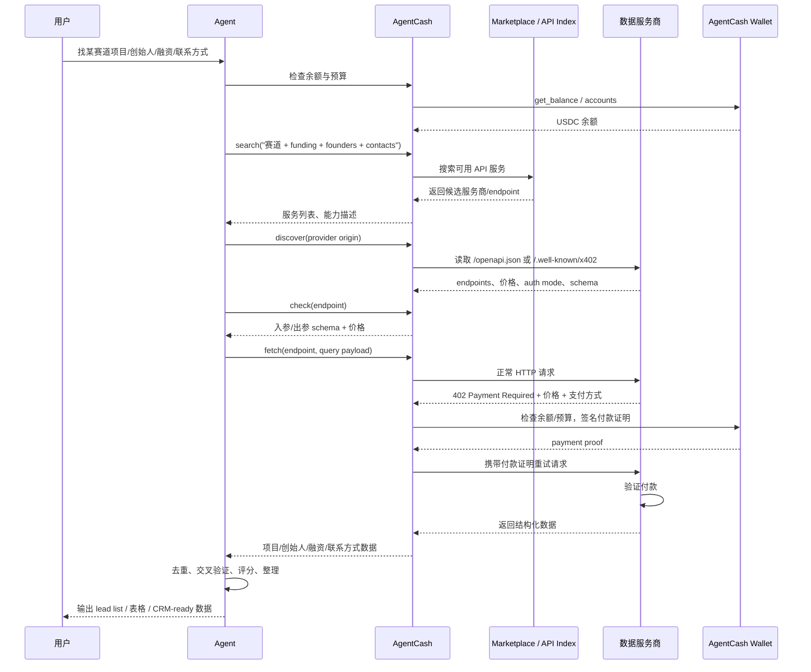

# Task: AgentCash Marketplace Transaction Flow


## 场景描述

用户提出需求：

> 找某赛道的项目、创始人、融资信息和联系方式。

agent 可以通过 AgentCash marketplace 搜索可用 API，例如公司研究、人物富集、融资信息、LinkedIn 数据、网页搜索、联系方式 enrichment 等服务。AgentCash 负责服务发现、schema 检查、余额检查、付款签名、自动重试和结果返回。

## 参与方

| 参与方 | 角色 |
| --- | --- |
| 用户 | 提出赛道、地区、阶段、数量、预算等研究目标 |
| Agent | 理解任务、规划检索路径、调用工具、整理结果 |
| AgentCash | marketplace / discovery / wallet / x402 或 MPP 支付层 |
| 数据服务商 | 提供公司、人物、融资、网页搜索、联系方式等数据 |
| AgentCash Wallet | 持有 USDC，签名付款证明 |
| 支付网络 | Base、Solana、Tempo 等 USDC 结算网络 |

## 完整交易流程



## 业务步骤拆解

### 1. 需求定义

用户用自然语言给出研究目标，例如：

> 找 30 个 AI infra / Web3 agent payment 赛道项目，要求过去 18 个月融资过，有创始人 LinkedIn 和邮箱。

agent 需要把目标拆成结构化约束：

- 赛道关键词
- 地区或语言范围
- 融资时间窗口
- 公司数量
- 创始人字段
- 联系方式字段
- 预算上限
- 输出格式

### 2. 钱包与预算检查

AgentCash 使用本地钱包支付 premium API。调用前应先检查余额和账户：

```bash
npx agentcash balance
npx agentcash accounts
```

在 MCP 模式下，对应工具是：

- `get_balance`
- `list_accounts`

如果余额不足，用户需要先给 AgentCash 钱包充值 USDC，再继续付费调用。

### 3. Marketplace 搜索服务能力

agent 根据任务目标搜索可用 API：

```bash
npx agentcash search "company funding founders contact enrichment"
```

在 MCP 模式下，对应工具是：

- `search`

这个阶段的目的不是直接购买数据，而是找到哪些服务商可以提供公司研究、人物富集、融资新闻、LinkedIn 数据、网页搜索或 email enrichment。

### 4. 发现服务商 endpoint

找到候选服务商后，agent 对服务商 origin 做 endpoint discovery：

```bash
npx agentcash discover https://stableenrich.dev
```

在 MCP 模式下，对应工具是：

- `discover_api_endpoints`

服务商通过 `/openapi.json` 暴露 endpoint、schema、价格和支付信息；旧服务也可能通过 `/.well-known/x402` 暴露。

### 5. 调用前检查 schema 与价格

正式调用前，agent 应检查目标 endpoint：

```bash
npx agentcash check <endpoint-url>
```

在 MCP 模式下，对应工具是：

- `check_endpoint_schema`

这个步骤确认：

- endpoint 能解决什么问题。
- 请求参数如何组织。
- 响应字段有哪些。
- 单次调用价格是多少。
- 是否需要 SIWX 身份认证。
- 是否需要 x402 / MPP 付款。

### 6. 执行数据采集链

一个完整的数据采集 pipeline 可以拆成：

| 阶段 | 目标 | 示例能力 |
| --- | --- | --- |
| 项目发现 | 找到目标赛道公司 | web search、company search、LinkedIn company search |
| 公司富集 | 补全官网、简介、行业、地区、员工数 | company enrichment |
| 融资信息 | 获取融资轮次、金额、时间、投资方 | news search、web scrape、funding data |
| 创始人识别 | 找到 founder / CEO / cofounder | people search、LinkedIn profile |
| 联系方式获取 | 获取邮箱或其他可联系渠道 | email enrichment、email verification |
| 数据清洗 | 去重、归一化、过滤不匹配对象 | local processing |
| 输出评分 | 按赛道匹配度、融资时间、可联系性排序 | scoring / ranking |

### 7. 单次付费 API 调用的交易机制

每个 paid API call 内部可以拆成以下状态：

```text
REQUEST_SENT
  -> PRICE_QUOTED_402
  -> PAYMENT_AUTHORIZED
  -> PAYMENT_PROOF_ATTACHED
  -> PROVIDER_VERIFIED
  -> DATA_DELIVERED
```

具体过程：

1. agent 发起普通 HTTP 请求。
2. 数据服务商返回 `402 Payment Required`，包含价格和接受的支付方式。
3. AgentCash 检查余额和预算。
4. AgentCash 使用本地钱包签名 USDC 付款证明。
5. AgentCash 携带付款证明自动重试原请求。
6. 服务商验证付款。
7. 服务商返回结构化数据。

AgentCash 文档说明，这个过程会在一次调用里完成；agent 最终拿到的是干净的数据响应。

### 8. 结果整理与交付

agent 将多次 API 调用结果整理为作业或业务输出：

- 项目列表
- 创始人列表
- 融资信息
- 联系方式
- 数据来源
- 置信度
- 最后验证时间
- 调用成本摘要

可交付格式包括：

- Markdown proof
- CSV / spreadsheet
- CRM import 格式
- lead list
- outreach draft

## 交易状态机

```text
USER_INTENT
  -> BUDGET_CHECKED
  -> PROVIDER_DISCOVERED
  -> ENDPOINT_SCHEMA_CHECKED
  -> REQUEST_SENT
  -> PRICE_QUOTED_402
  -> PAYMENT_AUTHORIZED
  -> PAYMENT_PROOF_ATTACHED
  -> PROVIDER_VERIFIED
  -> DATA_DELIVERED
  -> NORMALIZED_REPORT_READY
```


## 参考资源

- [AgentCash documentation](https://agentcash.dev/docs)
- [How it works](https://agentcash.dev/docs/how-it-works)
- [CLI overview](https://agentcash.dev/docs/cli/overview)
- [Wallet overview](https://agentcash.dev/docs/wallet/overview)
- [MCP mode](https://agentcash.dev/docs/mcp-mode)
