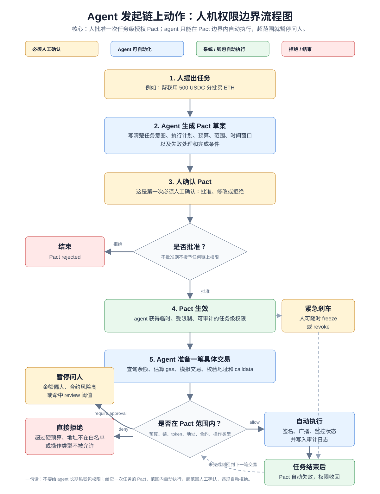

# 电商购物 Agent Wallet 权限策略

## Agent 发起链上动作流程图



核心原则：用户先批准一次任务级授权 Pact，agent 之后只能在 Pact 定义的预算、范围、时间窗口和操作类型内自动执行；超出软限制时必须暂停并请求人工确认，违反硬限制时直接拒绝。

## 设计目标

这个 wallet 只允许 agent 完成电商购物付款相关动作，不允许它做 DeFi、交易、借贷、NFT、桥接、任意转账或无限授权。

权限不应该长期授予 agent，而应该围绕一次订单、一次购物车或一个短时间窗口生成临时 Pact。任务完成、预算用完或时间到期后，权限自动失效。

## 1. 预算策略

建议采用三层预算：

| 类型 | 策略 |
| --- | --- |
| 单笔自动付款上限 | 单笔不超过 100 USD，且商户已在白名单内时可自动执行 |
| 单笔人工确认阈值 | 单笔超过 100 USD 但不超过 300 USD 时必须人工确认 |
| 单笔硬拒绝上限 | 单笔超过 300 USD 直接拒绝 |
| 24 小时滚动上限 | 24 小时累计不超过 500 USD |
| 7 天滚动上限 | 7 天累计不超过 1500 USD |

示例：

```json
{
  "budget": {
    "single_payment_auto_limit_usd": "100",
    "single_payment_review_limit_usd": "300",
    "hard_deny_above_usd": "300",
    "rolling_24h_limit_usd": "500",
    "rolling_7d_limit_usd": "1500"
  }
}
```

## 2. 可调用合约

默认拒绝所有合约调用，只允许白名单内的付款相关合约。

| 合约类型 | 是否允许 | 说明 |
| --- | --- | --- |
| USDC / 稳定币合约 | 允许 | 只允许 `transfer` 到白名单商户地址 |
| x402 / MPP 支付合约 | 允许 | 只允许付款类调用 |
| 商户结算合约 | 允许 | 必须是已验证商户合约 |
| Permit2 / token approval | 谨慎允许 | 必须限额、限期、限 spender，并触发人工确认 |
| DEX / lending / staking / bridge | 禁止 | 电商购物不需要 |
| 任意合约调用 | 禁止 | 默认 deny |

示例：

```json
{
  "contract_allowlist": [
    {
      "chain": "Base",
      "contract": "USDC",
      "functions": ["transfer"]
    },
    {
      "chain": "Base",
      "contract": "approved_x402_payment_contract",
      "functions": ["pay", "settle"]
    }
  ],
  "default": "deny"
}
```

## 3. 可执行动作

Agent 可自动执行：

- 查询余额
- 查询商品价格
- 生成购物车
- 估算 gas
- 模拟付款交易
- 检查商户地址是否在白名单
- 对白名单商户执行小额付款
- 查询订单状态
- 保存发票、订单号、交易哈希

必须人工确认：

- 第一次授权购物 Pact
- 新商户首次付款
- 单笔超过自动付款阈值
- 修改收货地址
- 购买礼品卡、数字资产、订阅或高风险商品
- 任何 token approval
- 任何合约白名单更新
- 任何预算提升

禁止动作：

- 向非商户地址转账
- 调用 DEX 兑换资产
- 借贷、质押、桥接
- 无限授权 `approve unlimited`
- 导出私钥
- 修改 owner、recovery 或 multisig 设置

## 4. 人工确认阈值

| 场景 | 处理 |
| --- | --- |
| 单笔不超过 100 USD 且商户已白名单 | 自动执行 |
| 单笔超过 100 USD | 人工确认 |
| 新商户首次付款 | 人工确认 |
| 运费或税费导致总价上涨超过 10% | 人工确认 |
| 商品类别为礼品卡、数字资产或订阅 | 人工确认 |
| 付款失败后重试超过 2 次 | 人工确认 |
| 需要 token approval | 人工确认 |
| 目标地址和订单商户不匹配 | 直接拒绝 |

## 5. 撤销方式

需要三种撤销机制：

| 撤销方式 | 作用 |
| --- | --- |
| 自动完成撤销 | 订单完成、预算用完或时间到期后，Pact 自动失效 |
| 手动 revoke | 用户永久终止本次购物任务授权 |
| emergency freeze | 紧急暂停 agent 对 wallet 的所有操作 |

建议每个购物 Pact 设置：

```json
{
  "completion_conditions": [
    { "type": "tx_count", "threshold": "1" },
    { "type": "amount_spent_usd", "threshold": "300" },
    { "type": "time_elapsed", "threshold": "3600" }
  ]
}
```

含义：付款成功 1 次、花费达到 300 USD，或 1 小时后，任一条件触发即自动失效。

## 6. 日志记录

每一步都要记录，但绝不能记录私钥、助记词、完整身份证件信息或完整收货地址。

必须记录：

- Pact ID
- Agent ID
- 用户确认时间
- 商户名称
- 商户钱包地址
- 商品摘要
- 订单号
- 支付金额
- Token 类型
- Chain ID
- 合约地址
- 函数名
- Policy 判断结果：`allow` / `require_approval` / `deny`
- 人工确认记录
- Transaction hash
- 失败原因
- Revoke / freeze 操作记录

日志格式示例：

```json
{
  "event": "payment_attempt",
  "pact_id": "pact_123",
  "agent_id": "shopping_agent_01",
  "merchant": "example_store",
  "chain": "base",
  "token": "USDC",
  "amount_usd": "82.40",
  "contract": "USDC",
  "action": "transfer",
  "policy_result": "allow",
  "tx_hash": "0x...",
  "timestamp": "2026-06-02T00:00:00Z"
}
```

## 推荐默认策略

- 只用稳定币付款，例如 USDC。
- 只允许付款到白名单商户。
- 单笔 100 USD 以下自动执行。
- 100 USD 以上必须人工确认。
- 每个购物任务 Pact 最长有效 1 小时。
- 每个 Pact 默认只允许 1 次成功付款。
- 任何新商户、新合约、approval、预算提升都必须人工确认。
- 所有不匹配规则的动作默认拒绝。

一句话总结：电商 agent wallet 不应该像普通钱包一样授权，而应该像公司采购卡一样授权：限定商户、限定金额、限定时间、限定用途、全程留痕，随时冻结。
