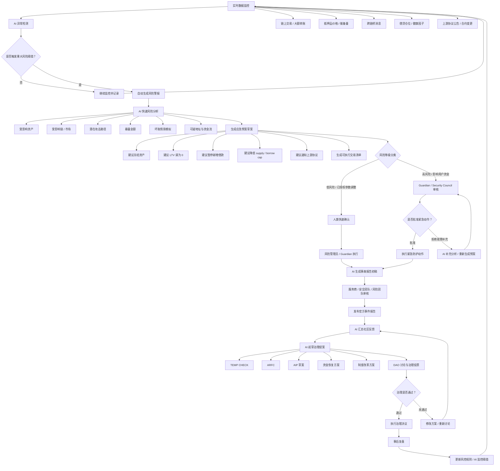

# Aave DAO rsETH 事件与 AI Alert-to-Action Workflow

## 任务目标

梳理 Aave DAO 在 2026 年 4 月 rsETH / KelpDAO / LayerZero 事件中的治理危机，并拆解如果 AI 参与 DAO 治理，哪些步骤可以由 AI 辅助，哪些步骤必须由人类、Guardian、Security Council 或正式治理流程确认。

重点产出一个面向 DAO 风险治理的 `alert-to-action workflow`。

## 背景

2026 年 4 月 18 日，KelpDAO 的 rsETH 跨链适配器发生异常释放 / 铸造事件。攻击者利用跨链消息验证问题，释放约 11.65 万枚 rsETH，并将大量 rsETH / wrsETH 注入 Aave V3 / V4 市场作为抵押品，借走真实 ETH 资产。

这不是一次直接攻破 Aave 核心合约的攻击，但它造成了 Aave 历史上重要的间接风险事件：上游抵押品被污染，Aave 因接受该资产作为抵押品而暴露在大额坏账、流动性出逃和治理信任危机中。

Foresight News 对该事件的描述包括：

- KelpDAO rsETH 漏洞规模约 2.9 亿美元；
- Aave 面临约 2 亿美元级别潜在坏账；
- Aave TVL 两日从约 263 亿美元降至 180 亿美元，蒸发约 83 亿美元；
- Aave 快速冻结相关 rsETH / wrsETH 市场，并将相关借款能力限制到 0。

Aave 官方论坛后续发布了 rsETH incident thread、incident report，以及 rsETH Incident Funding Update ARFC，讨论是否由 Aave DAO 参与恢复 rsETH backing、如何处理坏账、是否动用 DAO 财库或安全模块。

## Aave DAO 标准治理流程

Aave DAO 的标准治理流程可以概括为：

```text
Forum 讨论 -> TEMP CHECK Snapshot -> ARFC 详细方案 -> ARFC Snapshot -> AIP 上链投票 -> Timelock -> 执行
```

标准步骤：

1. 在 Aave Governance Forum 发起讨论。
2. 发布 TEMP CHECK 论坛帖，通常至少讨论 5 天。
3. 进行 TEMP CHECK Snapshot 链下投票，通常持续 3 天。
4. 发布 ARFC，即 Aave Request for Final Comments，补充技术、风险、资金和执行细节。
5. 进行 ARFC Snapshot 链下投票。
6. 准备 AIP，即正式上链提案，包含 metadata 和可执行 payload。
7. AIP 进入上链投票，先经过 voting delay，再进入 active voting。
8. 通过后进入 timelock。
9. timelock 结束后执行 payload。

这个流程适合透明治理和公开讨论，但在 rsETH 这类危机中会暴露出一个问题：平时的 DAO 流程是天级响应，黑天鹅事件需要分钟级响应。

因此，Aave 依赖 Guardian / Security Council / 风险管理员等紧急授权角色，在正式治理之前先做保护性动作，例如冻结资产、限制新增借款、将 LTV 调为 0。

## rsETH 事件中的治理危机

rsETH 事件的关键不只是坏账金额，而是责任归属和损失分配。

核心冲突包括：

- Aave 核心合约没有被攻破，但 Aave 用户和市场承担了上游协议失败的后果。
- KelpDAO / LayerZero 的跨链基础设施失败，是否应该由 Aave DAO 财库买单。
- 如果由 Aave 安全模块或 Umbrella 承担损失，会不会把外部协议风险转嫁给 AAVE 质押者。
- 如果 Aave 不承担损失，存款人信心、TVL 和 Aave 作为系统性 DeFi 基础设施的信誉会受损。
- 如果 Aave 每次都承担上游协议风险，未来可能形成“利润私有化、损失由 Aave DAO 社会化”的不良先例。

这个案例可以被定义为：

> Aave DAO 在 rsETH 上游污染事件中的危机治理：从紧急冻结到坏账社会化争议。

## AI 可以辅助的步骤

### 1. 实时监控与自动预警

AI 应该作为 DAO 的实时风险哨兵，而不是事后记录员。

AI 可以持续监控：

- 抵押品价格；
- 抵押品流通量；
- 底层储备量；
- 跨链桥消息；
- 异常铸造；
- 异常大额转账；
- 借贷仓位变化；
- 健康因子；
- 上游协议公告；
- 合约配置变更；
- 风险服务商和安全服务商信号。

一旦出现重大波动，例如抵押品短时间内异常增发、价格 / 储备偏离、单一地址快速注入大额抵押品并借出核心资产，AI 应自动发出高优先级预警。

预警对象应包括：

- Guardian；
- Security Council；
- 风险服务商；
- 安全服务商；
- 核心治理代表；
- 相关上游协议联系人。

### 2. 快速风险暴露盘点

AI 可以在几分钟内生成风险暴露报告：

- 哪些 Aave 市场列出了 rsETH / wrsETH；
- 哪些链受到影响；
- 攻击者地址存入了多少抵押品；
- 攻击者借走了哪些真实资产；
- 暴露金额是多少；
- 如果 rsETH 折价 10%、20%、50% 或归零，坏账分别是多少；
- 哪些用户、仓位、市场和资金池最敏感。

### 3. 自动起草应急预案

AI 可以基于预设规则生成应急预案草案：

- 建议冻结哪些资产；
- 建议在哪些链执行；
- 是否建议将 LTV 调为 0；
- 是否建议暂停新增借款；
- 是否建议降低 supply cap / borrow cap；
- 是否建议暂停 eMode；
- 是否需要通知 KelpDAO / LayerZero / L2 安全委员会；
- 是否需要进入 public communication mode；
- 是否需要生成可执行交易清单。

AI 的角色应该是“自动建议 + 人类快速确认”，而不是直接执行高影响动作。

### 4. 跨协议情报汇总

这次事件根源在上游协议，不在 Aave 核心合约。AI 可以把跨协议信息聚合到同一张态势图：

- KelpDAO 官方更新；
- LayerZero 技术说明；
- Aave 风险线程；
- 链上攻击路径；
- 资金流向；
- L2 安全委员会动作；
- 社区情绪；
- 媒体报道；
- 相关市场提款和利率变化。

### 5. 事故报告初稿

AI 可以辅助起草 incident report：

- 时间线；
- 攻击路径；
- 资金流向；
- 受影响市场；
- 已执行措施；
- 潜在坏账情景；
- 未确认信息；
- 后续需要治理确认的问题。

但官方报告必须由风险服务商、安全团队、开发服务商或授权代表审核后发布。

### 6. 治理提案草拟

AI 可以把治理选项整理成 TEMP CHECK / ARFC / AIP 草案：

- 背景；
- 动机；
- 恢复方案；
- 资金来源；
- 使用 DAO treasury 的影响；
- 使用 Umbrella / Safety Module 的影响；
- 借款或外部融资方案；
- 对 KelpDAO / LayerZero 的条件；
- 风险提示；
- 投票选项；
- 可执行 payload 的需求清单。

### 7. 社区意见归纳

AI 可以阅读论坛、Snapshot 评论、X 讨论，把社区观点聚类：

- 支持 DAO 出资恢复；
- 反对 Aave 为 KelpDAO / LayerZero 买单；
- 支持有条件救助；
- 要求 KelpDAO / LayerZero 承担责任；
- 要求改革抵押品准入；
- 担心 Umbrella / Safety Module 被政治化；
- 担心未来形成系统性道德风险。

### 8. 方案后果模拟

AI 可以模拟不同治理选择的后果：

- 使用 DAO treasury；
- slash Umbrella / Safety Module；
- 向外部借款；
- 出售 AAVE；
- 等待 KelpDAO 决策；
- 按链隔离损失；
- 对所有 rsETH 持有人社会化分摊；
- 只保护 Aave 存款人；
- 只恢复关键链或关键市场。

输出应包括对 TVL、AAVE 持有人、存款人、质押者、L2 市场、长期信任和未来治理先例的影响。

## 必须由人或治理流程确认的步骤

### 1. 是否升级为正式安全事件

AI 可以发出高优先级警报，但是否将其定义为正式 incident，必须由风险服务商、安全服务商、Guardian 或授权治理角色确认。

### 2. 是否冻结资产

冻结资产会影响真实用户的资金使用权。AI 可以建议冻结，但执行权应属于 Guardian、Security Council 或已授权风险管理员。

### 3. 官方事实认定

AI 可以分析攻击路径和资金流，但官方事实版本必须由人类服务商确认，尤其是责任归属、损失金额、攻击原因和仍待确认的信息。

### 4. 是否动用 DAO 财库

动用 DAO treasury 是典型治理决策，必须由 AAVE 持有人、delegates 或正式治理流程确认。

### 5. 是否 slash Umbrella / Safety Module

这一步涉及质押者是否被强制承担损失。AI 可以分析后果，但不能替代治理裁决，否则会变成“算法决定谁亏钱”。

### 6. 损失如何分配

以下问题都属于价值判断和政治判断：

- Aave DAO 承担多少；
- KelpDAO 承担多少；
- LayerZero 是否承担；
- rsETH 持有人是否社会化分摊；
- L2 用户是否单独承担；
- 是否全额补偿 Aave 存款人；
- 是否附加偿还、追偿或治理改革条件。

这些必须通过人类谈判和 DAO 治理决定。

### 7. 是否接受外部恢复联盟方案

DeFi United 这类联合恢复行动可能涉及多方承诺、抵押、借款、未来收入、法律责任和声誉风险。AI 可以审阅和模拟，但接受与否必须由 DAO 治理确认。

### 8. 协议级规则变更

事件后可能需要修改：

- LST / LRT 抵押品准入标准；
- 跨链资产风险评级；
- eMode LTV 上限；
- 上游储备证明要求；
- 自动熔断规则；
- Guardian 权限边界；
- Aave V4 半隔离市场设计；
- 上游协议抵押品保证金或保险基金要求。

这些属于长期制度设计，必须走治理讨论和正式投票。

### 9. 公开沟通口径

AI 可以起草公告，但最终口径必须由授权代表确认。危机中的公开表述可能引发提款、诉讼、市场误解或多方责任争议。

## AI Alert-to-Action Workflow



## 分工边界

| 阶段 | AI 适合做什么 | 人 / 治理必须做什么 |
| --- | --- | --- |
| Alert | 实时监控、发现异常、发预警 | 判断是否升级为正式事件 |
| Analysis | 暴露盘点、坏账模拟、攻击路径初判 | 审核事实、确认风险等级 |
| Action | 起草冻结、调参、熔断预案 | Guardian / Security Council 执行 |
| Report | 生成事故报告初稿 | 服务商审核发布 |
| Governance | 起草 ARFC / AIP、总结社区意见 | token holders / delegates 投票 |
| Recovery | 模拟资金方案、追偿方案 | 是否用财库、slash、融资 |
| Reform | 提出风控规则更新 | DAO 正式采纳并执行 |

## 核心结论

AI 的角色应从“事后记录员”前移为“实时风险雷达 + 应急预案生成器”。

AI 可以自动报警、自动分析、自动起草预案、自动生成报告草稿、自动模拟治理方案。但 AI 不能自动决定冻结用户资产、动用 DAO 财库、slash 安全模块或分配损失。

DAO 治理中真正需要人类确认的是：

- 谁承担损失；
- 谁拥有紧急权力；
- 谁被保护；
- 谁被牺牲；
- 哪些先例会影响未来治理；
- 是否将一次危机变成长期制度改革。

rsETH 事件说明，DeFi 协议的风险管理边界已经不再局限于自身代码审计，而是延伸到整个抵押品供应链、跨链基础设施和上游协议治理。AI 可以帮助 DAO 更早发现风险、更快生成预案，但合法性、责任和价值取舍仍必须留在人类治理流程中。

## 参考资源

- Foresight News: https://foresightnews.pro/article/detail/96472
- Aave Governance: rsETH incident — 2026-04-18: https://governance.aave.com/t/rseth-incident-2026-04-18/24481
- Aave Governance: rsETH Incident Report: https://governance.aave.com/t/rseth-incident-report-april-20-2026/24580
- Aave Governance: rsETH Incident Funding Update: https://governance.aave.com/t/arfc-rseth-incident-funding-update/24740
- Aave Help: Proposals: https://aave.com/help/governance/proposals
- Aave Help: Voting: https://aave.com/help/governance/voting
