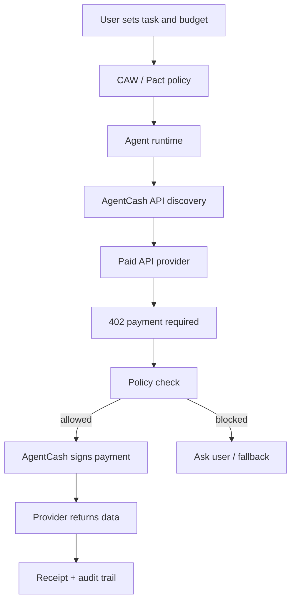

# AgentCash Research Report

> 生成日期：2026-06-06
> 研究主题：AgentCash 解决什么问题、边界是什么、还缺什么
> 关联项目：Citely / Agentic Commerce / x402 Paywall / CAW Agent Payment

## 一句话结论

AgentCash 解决的是“AI Agent 如何在运行时发现付费 API，并用稳定币按次付款调用”的问题。它把 API discovery、schema 检查、余额检查、x402 / MPP 付款、签名、重试和结果返回封装成 Agent 可以直接使用的工具层。

但它不是完整的商业系统：不负责用户业务判断、不替代 CAW / Pact 这种细粒度钱包权限系统、不解决托管仲裁、不保证 API 质量，也不能自动覆盖所有还没有接入 x402 / MPP 的传统 API。

## AgentCash 解决什么问题

### 1. 解决 Agent 调用付费 API 的账号与付款摩擦

传统 API 通常假设调用者是人类开发者：

- 人去注册账号。
- 人去绑定信用卡。
- 人去购买套餐。
- 人把 API key 放进环境变量。
- Agent 只能在预先配置好的服务里调用。

这个模式不适合 autonomous agent。Agent 在执行任务时可能临时需要一个数据源、一个搜索 API、一个 enrichment API 或一个图片生成 API。它不应该为了 1 次或 3 次调用去开一个月订阅，也不应该依赖人为提前给每个供应商配置 API key。

AgentCash 的核心价值是把“按次购买 API 能力”变成一个运行时动作：Agent 先发现服务，再检查价格和 schema，最后用本地钱包支付并拿到结果。

### 2. 解决服务发现与 schema 检查问题

AgentCash 不只是付款工具，也承担 API marketplace / discovery 的角色。

官方文档描述的流程是：服务方通过 `/openapi.json` 暴露 endpoint、schema、价格和支付信息；旧服务也可以通过 `/.well-known/x402` 暴露付款信息。AgentCash 可以让 Agent 在付款前先知道：

- 有哪些 API 可以用。
- endpoint 是什么。
- 输入输出 schema 是什么。
- 每次调用价格是多少。
- 是否需要 x402 / MPP 付款。

这对于 Agent 很重要，因为 Agent 如果无法在付款前理解 schema 和价格，就很容易错误调用、重复付款或购买不符合任务目标的数据。

### 3. 解决 x402 / MPP 付款握手复杂度

AgentCash 支持 x402 和 MPP 两类开放支付标准。典型流程是：

1. Agent 发起普通 HTTP 请求。
2. 服务方返回 `402 Payment Required`，附带价格和可接受付款方式。
3. AgentCash 使用本地钱包签名付款证明。
4. AgentCash 携带付款证明重试原请求。
5. 服务方验证付款后返回数据。

对 Agent 来说，最终体验接近“调用普通 API”，而不是手写钱包签名、构造 payment header、处理重试和解析结算响应。

### 4. 解决 Agent 经济里的最小“花钱能力”

在 Agentic Commerce 里，Agent 需要购买的可能不是商品，而是任务中间能力：

- 搜索一组公司。
- 查某个创始人资料。
- 获取社媒数据。
- 购买网页抓取结果。
- 调用图片 / 视频生成。
- 购买邮箱验证、地图、职位、旅行等数据。

AgentCash 的定位是“让 Agent 有一个可支配的 USDC 余额，并在预算内按次购买外部能力”。这与 Citely 的方向一致：Agent 不是只读信息处理器，而是可以在授权边界内参与经济活动。

## AgentCash 的工作边界

### 1. 它是支付与 API 访问层，不是业务决策层

AgentCash 可以帮助 Agent 支付并调用 API，但不判断“这个 API 是否值得买”。是否购买仍然需要上层 Agent workflow 做决策：

- 这个数据是否和任务相关？
- 是否有免费替代来源？
- 是否值得支付这个价格？
- 是否会暴露用户隐私？
- 是否可能重复调用造成浪费？

因此 AgentCash 应该被放在一个受控 workflow 里，而不是让 Agent 无限制调用。

### 2. 它是 wallet-based payment，不等于完整 Agent Wallet 权限系统

AgentCash 的文档把它描述为 wallet-based model：开发者创建本地钱包，用 USDC 充值，Agent 通过 x402 / MPP 支付 API 服务。这个模型适合按次 API micropayment。

但如果项目需要更复杂的钱包权限，例如：

- 每个域名不同预算。
- 每类操作不同权限。
- 单笔、单日、单任务限额。
- 只允许调用某些合约方法。
- 用户审批 Pact 后 Agent 才能执行。
- 多签、撤销、审计和紧急暂停。

这些更接近 CAW / Pact 或智能账户策略层的职责。AgentCash 可以作为“API 付款工具”，但不是完整的钱包安全边界。

### 3. 它不解决传统 API 的账号体系

AgentCash 只对接支持 x402 / MPP 或被其 marketplace 编排的服务。对于仍然要求传统 API key、OAuth、订阅、企业合同或人工审核的服务，AgentCash 不能自动绕过这些流程。

换句话说，AgentCash 让支持 agentic payment 的服务更容易被 Agent 使用，但它不能让整个 Web2 API 世界立刻变成 pay-per-call marketplace。

### 4. 它不等于托管、验收和仲裁协议

AgentCash 更适合“请求即交付”的场景：

- 付费搜索。
- enrichment。
- 文件上传。
- 图片生成。
- 一次 API 调用。

但如果任务是“完成一项复杂服务后再付款”，就需要额外机制：

- 报价。
- 里程碑。
- 交付物验收。
- 退款。
- 争议处理。
- 第三方仲裁。

这些不属于 AgentCash 的核心边界，更像 ERC-8183、ACP、escrow 或 marketplace contract 要解决的问题。

### 5. 它不保证数据质量、供应商信誉和结果真实性

AgentCash 可以返回 API 结果，但它不天然回答：

- 这个数据源是否可靠？
- 服务商是否长期稳定？
- 返回内容是否 hallucinated？
- enrichment 是否侵犯隐私？
- 价格是否合理？
- 是否存在重复计费或返回空数据？

因此在 Citely / Agent Commerce 语境里，AgentCash 需要和 reputation、receipt、source attribution、review、refund policy 一起使用。

## 还缺什么

### 1. 更强的预算与策略表达

AgentCash 已经能做余额检查和按次付款，但真实 Agent 场景需要更细的 policy：

- 每个任务预算。
- 每个 endpoint 预算。
- 每个供应商预算。
- 每小时 / 每日调用上限。
- 同一资源去重。
- 高风险 API 必须人工确认。
- 超出阈值自动降级到免费来源。

如果没有这些限制，Agent 可能因为循环调用、错误规划或 prompt injection 而产生不必要支出。

### 2. 更清晰的付款 receipt 与审计接口

Agent 调用付费 API 后，用户需要知道：

- 为什么买？
- 买了什么？
- 花了多少钱？
- 付给谁？
- 返回了什么？
- 哪个任务触发了付款？
- 是否可复现？

AgentCash 的 payment flow 已经能完成付款，但上层应用还需要标准化 receipt：

```json
{
  "taskId": "citely-agent-run-001",
  "provider": "stableenrich.dev",
  "endpoint": "/api/example",
  "resource": "company_enrichment",
  "amount": "0.028",
  "currency": "USDC",
  "network": "base",
  "reason": "Need company data for report generation",
  "paymentProof": "tx_or_x402_proof",
  "resultHash": "sha256_of_response",
  "createdAt": "2026-06-06T00:00:00Z"
}
```

这类 receipt 对 Citely 很关键，因为 Citely 要证明 Agent 为什么付款、付款后解锁了什么、内容和支付如何对应。

### 3. 供应商信誉与结果质量层

AgentCash 解决“能不能买”，但还需要一层解决“该不该买”：

- API provider reputation。
- 成功率。
- 延迟。
- 退款率。
- 数据新鲜度。
- 隐私风险。
- 价格历史。
- 同类 API 对比。

没有这层，Agent 会把“可调用”误认为“值得调用”。

### 4. x402 安全加固

近期安全研究指出，x402 类协议存在跨层攻击面，包括授权绑定、重放保护、Web 层处理和“已付款但被拒绝 / 未付款却获得服务”等风险。另有研究关注 x402 payment metadata 中可能泄露 PII，需要在付款前过滤 resource URL、description、reason 等字段。

因此 AgentCash / x402 相关应用至少需要：

- payment request 与具体资源强绑定。
- 防 replay。
- 防重复付款。
- 对 payment metadata 做隐私过滤。
- 对失败结算做明确错误处理。
- 对 paid-but-denied 做退款或人工复核路径。

### 5. 非 x402 服务的桥接方案

现实世界里，大量高价值 API 仍然是 API key / OAuth / subscription 模式。AgentCash 要成为更通用的 Agent Commerce layer，需要更多 bridge：

- 服务商托管代理。
- API key -> x402 wrapper。
- 企业 API 的 usage-based billing adapter。
- 传统 SaaS 的 pay-per-call reseller。
- OAuth 账号权限与钱包付款的组合授权。

否则 AgentCash 的体验会受限于 x402 / MPP provider 覆盖范围。

### 6. 与 CAW / Pact / 智能账户的组合模式

AgentCash 适合解决“Agent 如何为 API 付款”，CAW / Pact 适合解决“Agent 在什么权限边界内付款”。两者组合会更接近 production：



在 Citely 中，推荐分工是：

- AgentCash：发现付费 API、完成 x402 / MPP 调用、返回数据。
- CAW / Pact：约束 Agent 支出、域名、额度和操作范围。
- Citely app：记录任务理由、receipt、内容 proof、作者 proof 和用户可见审计日志。

## 对 Citely 的启发

Citely 可以把 AgentCash 作为“外部付费能力采购层”的参考对象，而不是直接把它等同于最终产品。

可复用的设计：

- HTTP 402 paywall。
- Agent 按次支付。
- 付款前展示 price / schema / resource。
- 支付后返回 clean response。
- 用 receipt 记录付款原因和结果。

需要额外补的设计：

- 作者内容证明。
- 读者 / Agent 解锁记录。
- CAW / Pact 权限边界。
- 支付与内容 hash 绑定。
- 退款 / 失败路径。
- 用户可读审计日志。

## 最小验证计划

### MVP 版本

- 用 AgentCash 或 AgentCash-like flow 调用一个付费 API。
- 捕获 price、endpoint、payment proof、response hash。
- 把这些信息写入 Citely audit log。
- 在 UI / README 中展示“Agent 为什么付款、买了什么、结果是什么”。

### Fallback 版本

如果真实 AgentCash 调用或余额不可用：

- 用 mock paid API 返回 402。
- 用 mock AgentCash receipt 表达付款。
- 保留真实 schema check 和 audit log。
- README 中明确说明 payment 是 mock，接口边界是真实设计。

### 成功标准

- 能展示一次完整调用链：
  - Agent 发现付费 API。
  - 检查价格和 schema。
  - 在预算内付款或生成 mock payment。
  - 拿到结果。
  - 生成 receipt。
  - 将 receipt 关联到 Citely 的文章 / 报告 / 解锁动作。

## 参考资料

- AgentCash Docs: https://agentcash.dev/docs
- AgentCash How It Works: https://agentcash.dev/docs/how-it-works
- AgentCash MCP Mode: https://agentcash.dev/docs/mcp-mode
- Payments for AI Agents: https://agentcash.dev/learn/payments-for-ai-agents
- Five Attacks on x402 Agentic Payment Protocol: https://arxiv.org/abs/2605.11781
- Hardening x402: PII-Safe Agentic Payments via Pre-Execution Metadata Filtering: https://arxiv.org/abs/2604.11430

